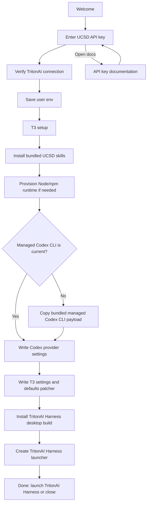

# Architecture

## Goal

Ship a double-clickable installer that configures TritonAI Harness as UCSD's single coding harness, backed by Codex and UCSD/TritonAI models.

## Flow

## Installer Layers

- `renderer`: the user-facing Electron screen flow.
- `main`: IPC boundary and privileged desktop launch action.
- `installer/runner`: ordered TritonAI Harness/Codex setup execution.
- `installer/prerequisites`: user-scoped Node.js/npm bootstrap with checksum verification.
- `installer/t3code-desktop`: TritonAI desktop app install. The bundled app may use release-channel names internally, but the user-facing launcher is always `TritonAI Harness`.
- `installer/skills`: copies packaged UCSD skills into `~/.tritonai-harness/codex/skills/`.
- `installer/codex-vendor`: finds the packaged Codex CLI payload and copies it into the managed runtime prefix.
- `installer/tool-manifest`: TritonAI Harness metadata and the pinned Codex CLI backend fallback install command for unpackaged development runs.
- `installer/config-writers`: Codex provider settings and default selection enforcement.
- `installer/profile`: user environment variable setup.

## UCSD Managed Defaults

- Base URL: configured at package time through `UCSD_AI_BASE_URL`.
- Shared API env: `TRITONAI_API_KEY`
- Codex/TritonAI Harness default: `deepseek-v4-flash`
- Codex/TritonAI Harness models: the UCSD upstream renders as `UCSD`; the current installer exposes `DeepSeek v4 Flash`.
- Skills source: nearby local `UCSD-Skills-Library` checkout when present, otherwise latest `main` from `https://github.com/dbalders/UCSD-Skills-Library.git`, staged from `skills/` or `tritonai/` into `vendor/skills/` at package time
- Runtime: pinned Node.js `v22.22.2` downloaded under `~/.agents/ucsd/runtime`
- Codex runtime: pinned `@openai/codex@0.141.0` staged into `vendor/codex-cli/mac-arm64` and `vendor/codex-cli/win-x64`, then copied under `~/.agents/ucsd/runtime/codex/openai-codex-0.141.0`; TritonAI Harness settings reference it explicitly instead of relying on `PATH`.
- Default policy posture: local user control with UCSD routing, logs directory, and deny guidance around secrets.

## Release Work Still Needed

- Confirm final UCSD gateway endpoint, model names, telemetry endpoint, and bearer-token strategy.
- Decide whether API keys should be stored in shell env, OS keychain, or exchanged for short-lived UCSD tokens.
- Decide whether to bundle Node.js inside the packaged installer artifact or download it at first run.
- Add Windows code signing to the NSIS installer for the UCSD installer app itself.
- Add richer UCSD gateway status messaging without leaking key material into logs.
