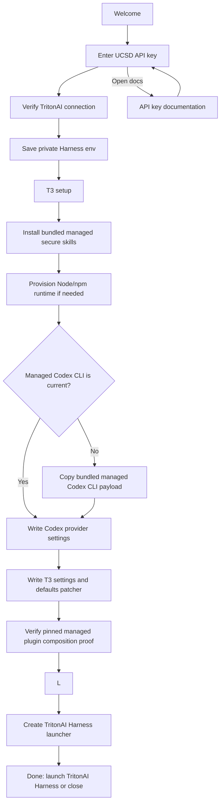

# Architecture

## Goal

Ship a double-clickable installer that configures TritonAI Harness as UCSD's single coding harness, backed by Codex and UCSD/TritonAI models.

## Flow

## Installer Layers

- `src`: TypeScript source for the Electron application and installer pipeline.
- `dist/src`: emitted JavaScript packaged into Electron; generated by `npm run build` and never edited directly.
- `renderer`: the user-facing Electron screen flow.
- `main`: IPC boundary and privileged desktop launch action.
- `installer/runner`: ordered TritonAI Harness/Codex setup execution.
- `installer/prerequisites`: user-scoped Node.js/npm bootstrap with checksum verification.
- `installer/t3code-desktop`: parent-native module that installs only the canonical `TritonAI Harness` desktop identity.
- `installer/skills`: transactionally installs only packaged secure skills into `~/.tritonai-harness/codex/skills/` and tracks Installer ownership without modifying unowned skills.
- `installer/codex-vendor`: finds the packaged Codex CLI payload and copies it into the managed runtime prefix.
- `installer/plugins`: validates the packaged proof that the selected canonical plugin packages were statically composed into the bundled Harness release.
- `installer/tool-manifest`: TritonAI Harness metadata and the pinned Codex CLI backend fallback install command for unpackaged development runs.
- `installer/config-writers`: Codex provider settings and default selection enforcement.
- `installer/profile`: private environment file used only by the TritonAI Harness launcher. Fresh installs do not modify shell profiles or Windows user variables; upgrades remove only exact legacy hooks and values previously written by this Installer.
- `scripts`: TypeScript source for validation, tests, vendoring, packaging, and release helpers; emitted under `dist/scripts` before execution.

## UCSD Managed Defaults

- Base URL: configured at package time through `UCSD_AI_BASE_URL`.
- Shared API env: `TRITONAI_API_KEY`
- Codex/TritonAI Harness default: `api-deepseek-v4-flash`
- Codex/TritonAI Harness models: every valid key receives `DeepSeek v4 Flash`; keys that pass the external-model probe also receive `GPT-5.5` and `Claude Opus 4.8`.
- Secure skills source: nearby local `UCSD-Skills-Library-Secure` checkout when present, otherwise `main` from private `https://github.com/dbalders/UCSD-Skills-Library-Secure.git`, staged from root-level `<skill-name>/SKILL.md` folders into `vendor/skills/` at package time. Public AI Team and Community skills are fetched by TritonAI Harness and are not Installer payloads.
- Secure ownership: the vendor and runtime manifests use `{ "version": 1, "kind": "tritonai-secure", "skills": ["..."] }`. The runtime manifest lives at `~/.tritonai-harness/codex/skills/.tritonai-managed-skills.json`. Reinstall replaces/removes only names in the previous runtime manifest, preserves all unowned folders, and refuses unowned collisions.
- Secure update safety: all incoming skills and `SKILL.md` files are validated and copied to a same-filesystem staging directory before existing managed directories are moved. A failed staging or activation step leaves or restores the prior managed bundle.
- Managed plugin source: release packaging requires an explicit canonical `dbalders/TritonAI-Plugins` ref, full commit, and sorted package-id selection. It never infers the nearby development checkout. Selected package contents are validated and atomically staged as a Harness build input.
- Managed plugin composition: the Harness build owns the immutable catalog and must publish `tritonai-plugin-composition.json` containing the exact Installer-generated source identity, package selection, per-file digests, and filename/size/SHA-512 bindings for the release artifacts. Installer packaging rejects missing, mismatched, or unbound proofs and bundles the proof beside the Harness asset on macOS, Windows Setup, and Windows portable paths.
- Managed plugin lifecycle: Installer owns the whole Harness desktop deployment, not separate runtime plugin folders. Harness startup transactionally reconciles the statically included packages and preserves enablement, skill preferences, user-added content, and scoped credentials. Provider-aware retirement remains a Harness migration, so Installer does not delete plugin state or credentials during upgrade or rollback.
- Runtime: pinned Node.js `v22.22.2` downloaded under `~/.agents/ucsd/runtime`
- Codex runtime: pinned `@openai/codex@0.144.3` staged into `vendor/codex-cli/mac-arm64` and `vendor/codex-cli/win-x64`, then copied under `~/.agents/ucsd/runtime/codex/openai-codex-0.144.3`; TritonAI Harness settings reference it explicitly instead of relying on the user's `PATH`. The launcher scopes its private runtime environment to Harness and leaves the user's normal Codex configuration untouched.
- Default policy posture: local user control with UCSD routing, logs directory, and deny guidance around secrets.

## Release Work Still Needed

- Add the selected production provider to Harness-owned static catalog composition, consume `vendor/plugins/` as a reviewed build input, and publish the artifact-bound composition sidecar with every Harness platform release. Until that cross-repository prerequisite lands, the no-plugin Installer path is limited to the known plugin-free Harness `0.2.7` baseline; later Harness versions fail closed without a proof instead of silently shipping an unreviewed catalog.

- Confirm final UCSD gateway endpoint, model names, telemetry endpoint, and bearer-token strategy.
- Decide whether API keys should be stored in shell env, OS keychain, or exchanged for short-lived UCSD tokens.
- Decide whether to bundle Node.js inside the packaged installer artifact or download it at first run.
- Add Windows code signing to the NSIS installer for the UCSD installer app itself.
- Add richer UCSD gateway status messaging without leaking key material into logs.
