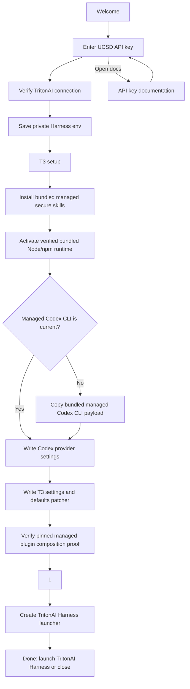

# Architecture

## Goal

Ship a double-clickable installer that configures TritonAI Harness as UCSD's single coding harness, backed by Codex and UCSD/TritonAI models.

## Flow

```mermaid
flowchart TD
  A["Welcome"] --> B["Enter UCSD API key"]
  B --> V["Verify TritonAI connection"]
  B -->|"Open docs"| D["API key documentation"]
  V --> C["Save private Harness env"]
  D --> B
  C --> E["T3 setup"]
  E --> S["Install bundled managed secure skills"]
  S --> F["Activate verified bundled Node/npm runtime"]
  F --> G{"Managed Codex CLI is current?"}
  G -->|"Yes"| J["Write Codex provider settings"]
  G -->|"No"| I["Copy bundled managed Codex CLI payload"]
  I --> J
  J --> K["Write T3 settings and defaults patcher"]
  K --> P["Verify pinned managed plugin composition proof"]
  P --> L
  L --> M["Create TritonAI Harness launcher"]
  M --> N["Done: launch TritonAI Harness or close"]
```

## Installer Layers

- `src`: TypeScript source for the Electron application and installer pipeline.
- `dist/src`: emitted JavaScript packaged into Electron; generated by `npm run build` and never edited directly.
- `renderer`: the user-facing Electron screen flow.
- `main`: IPC boundary and privileged desktop launch action.
- `installer/runner`: ordered TritonAI Harness/Codex setup execution.
- `installer/prerequisites`: user-scoped, transactional Node.js/npm activation from the checksum-bound platform payload bundled at package time. Unpackaged development runs retain an atomic, timeout-bounded download fallback.
- `installer/t3code-desktop`: parent-native module that installs only the canonical `TritonAI Harness` desktop identity.
- `installer/skills`: transactionally installs only packaged secure skills into `~/.tritonai-harness/codex/skills/` and tracks Installer ownership without modifying unowned skills.
- `installer/codex-vendor`: finds the packaged Codex CLI payload and copies it into the managed runtime prefix.
- `installer/plugins`: validates the packaged proof that the selected canonical plugin packages were statically composed into the bundled Harness release.
- `installer/tool-manifest`: TritonAI Harness metadata and the pinned Codex CLI backend fallback install command for unpackaged development runs.
- `installer/config-writers`: Codex provider settings and default selection enforcement.
- `installer/profile`: private environment file used only by the TritonAI Harness launcher. Fresh installs do not modify shell profiles or Windows user variables; upgrades remove only exact legacy hooks and values previously written by this Installer.
- `scripts`: TypeScript source for validation, tests, vendoring, packaging, and release helpers; emitted under `dist/scripts` before execution.

## UCSD Managed Defaults

- Base URL: configured at package time through `UCSD_AI_BASE_URL`.
- Access-key help: defaults to the official TritonAI Developer API Get Started page and can be overridden at package time through `UCSD_AI_DOCS_URL`.
- Shared API env: `TRITONAI_API_KEY`
- Codex/TritonAI Harness default: `api-glm-5.3`
- Codex/TritonAI Harness models: every valid key receives `GLM 5.3`, `DeepSeek v4 Flash`, and `Gemma 4 31B`; keys that pass the single `GPT-5.6 Sol` external-model probe also receive `GPT-5.6 Luna`, `GPT-5.6 Sol`, `GPT-5.6 Terra`, and `Claude Opus 5`. Existing `GLM 5.2`, `GPT-5.5`, and `Claude Opus 4.8` selections migrate to `GLM 5.3`, `GPT-5.6 Sol`, and `Claude Opus 5`, respectively, or to the restricted default when the key does not have frontier access.
- Secure skills source: nearby local `UCSD-Skills-Library-Secure` checkout when present, otherwise `main` from private `https://github.com/dbalders/UCSD-Skills-Library-Secure.git`, staged from root-level `<skill-name>/SKILL.md` folders into `vendor/skills/` at package time. Release packaging requires a clean checkout resolved to an exact recorded commit; it does not require a new commit when the secure-skills content is unchanged. Public AI Team and Community skills are fetched by TritonAI Harness and are not Installer payloads.
- Secure ownership: the vendor and runtime manifests use `{ "version": 1, "kind": "tritonai-secure", "skills": ["..."] }`. The runtime manifest lives at `~/.tritonai-harness/codex/skills/.tritonai-managed-skills.json`. Reinstall replaces/removes only names in the previous runtime manifest, preserves all unowned folders, and refuses unowned collisions.
- Secure update safety: all incoming skills and `SKILL.md` files are validated and copied to a same-filesystem staging directory before existing managed directories are moved. A failed staging or activation step leaves or restores the prior managed bundle.
- Managed plugin source: stable release packaging reads `config/managed-plugin-catalog.json`, which freezes the exact canonical source, publisher and release policy, package and manifest digests, and SDK artifact descriptor digest when present. Candidate builds may resolve a newer stable tag without changing production approval. Explicit development pins never override production policy. Selected package contents are validated and atomically staged as a Harness build input.
- Managed plugin composition: the Installer selects exact reviewed package bytes but does not construct providers or interpret their configuration. Each provider package owns its exact `manifest` and synchronous `createIntegrationProvider({ secrets, configuration })` factory; Harness validates and hosts that generic contract in its immutable catalog. Harness publishes platform-specific `tritonai-plugin-composition-<platform>-<arch>.json` proofs after all signing/notarization/stapling. Each proof contains the exact Installer-generated source identity, package selection, per-file digests, and filename/size/SHA-512 binding for that platform's final artifact. Installer packaging rejects missing, mismatched, stale, or unbound proofs and bundles the selected proof as `tritonai-plugin-composition.json` beside the Harness asset on macOS, Windows Setup, and Windows portable paths.
- Managed plugin lifecycle: Installer owns the whole Harness desktop deployment, not separate runtime plugin folders. Harness startup transactionally reconciles the statically included packages and preserves enablement, skill preferences, user-added content, and scoped credentials. Provider-aware retirement remains a Harness migration, so Installer does not delete plugin state or credentials during upgrade or rollback.
- Runtime: pinned Node.js `v22.23.2` archives are bound to repository-reviewed per-platform SHA-256 digests. Release preparation requires both the published Node checksum manifest and the downloaded archive to match that independent pin before bundling the archive as a real `extraResources` payload outside ASAR so native `tar`/`Expand-Archive` can consume it. Updating the Harness or Installer does not change these pins; they are reviewed only when the Node version or supported platform archive changes. The runtime is transactionally activated under `~/.agents/ucsd/runtime`. A packaged install never depends on `nodejs.org`; a missing or invalid runtime payload stops before Harness activation.
- Failure attribution: support reports record both the exact failed step and a stable owner component (`installer-startup`, `installer-prerequisites`, `tritonai-service`, `managed-codex`, `harness-desktop`, or `installer-finalization`). Thrown non-Error values are normalized without losing the original message, and missing report storage never masks the installation's actual result.
- Capacity: before creating or replacing managed state, the Installer measures free space on the user's target filesystem and reserves capacity from the actual bundled payload size, including expansion, staging, and rollback headroom. An insufficient-space result fails before installation mutation begins.
- macOS launcher ownership: the shared `/Applications` launcher resolves `$HOME` at launch time instead of baking in the installing account. If a standard account cannot update the shared launcher, setup installs a per-user fallback under `~/Applications` and remains successful.
- Release boot identity: the final stapled macOS DMG and both Windows distribution candidates must launch the packaged Installer, render a visible ready window, stay healthy for five seconds, emit a version/platform/architecture marker, and exit cleanly with status zero. The current Windows packaging lane can cross-build and records explicit unsigned SHA-256/PE proof without claiming launch success; `verify:win-installer:native` re-hashes those exact bytes and creates the boot proof only on native Windows. The future signed lane additionally binds publisher verification. Smoke mode uses isolated temporary Electron state, does not read an existing API key, rejects its installation IPC, and cannot mutate managed state.
- Installer lifecycle isolation: Electron's single-instance lock prevents separate Installer processes for the same user from mutating state concurrently, and only one install transaction may run inside that process. A second launch focuses the existing window. Window-close and normal quit requests are blocked while mutation is active, with an explicit keep-open notice; forced process termination and OS power loss remain recoverable interruption cases rather than supported cancellation. Progress delivery and support-report writes are observers: a destroyed renderer or diagnostics-write failure is recorded to stderr but cannot convert an otherwise successful install into a failed mutation.
- Crash-consistent mutation: environment and legacy-profile files, Windows migration state, managed Codex launchers, and the Windows desktop launcher use same-directory durable temporary writes; the desktop shortcut is staged before replacement. Node.js, Codex CLI, the managed macOS Harness app, its launcher, and the multi-skill bundle write validated same-filesystem transaction journals before the first rename. A later run either proves the replacement complete, restores the previous validated payload, or fails closed while preserving evidence; it never guesses that a partial directory is user-owned state.
- Bounded native work: managed command/version probes, Windows environment discovery and legacy cleanup, Node archive extractors, and macOS/Windows native helpers have explicit watchdogs. POSIX helpers run in owned process groups and verify group disappearance even when the leader exits first; Windows timeout handling uses `taskkill /t /f`. A timeout is reported only after tree termination is confirmed, and inability to confirm termination fails closed even for optional verification. The nested Windows NSIS path receives a twenty-minute budget in the direct and PowerShell routes; PowerShell also owns an internal `WaitForExit` deadline and terminates only the exact installer PID. If both safe routes are blocked, installation fails closed instead of launching an unowned `cmd.exe start` child.
- Bounded recovery downloads: unpackaged development recovery uses atomic temporary files, retry limits, five redirects at most, a 30-second idle watchdog, and a ten-minute total deadline per attempt. Release manifests are capped at 1 MiB. Packaged installers never depend on this path because their Harness and Node.js payloads must already be vendored and verified.
- Codex runtime: pinned `@openai/codex@0.151.0` staged into `vendor/codex-cli/mac-arm64` and `vendor/codex-cli/win-x64`, then copied under `~/.agents/ucsd/runtime/codex/openai-codex-0.151.0`; TritonAI Harness settings reference it explicitly instead of relying on the user's `PATH`. The launcher scopes its private runtime environment to Harness and leaves the user's normal Codex configuration untouched.
- Default policy posture: local user control with UCSD routing, logs directory, and deny guidance around secrets.

## Release Work Still Needed

- Confirm final UCSD gateway endpoint, model names, telemetry endpoint, and bearer-token strategy.
- Decide whether API keys should be stored in shell env, OS keychain, or exchanged for short-lived UCSD tokens.
- Provision and maintain the Azure Trusted Signing release identity and its seven required secret/configuration values on the dedicated Windows release host.
- Add richer UCSD gateway status messaging without leaking key material into logs.
